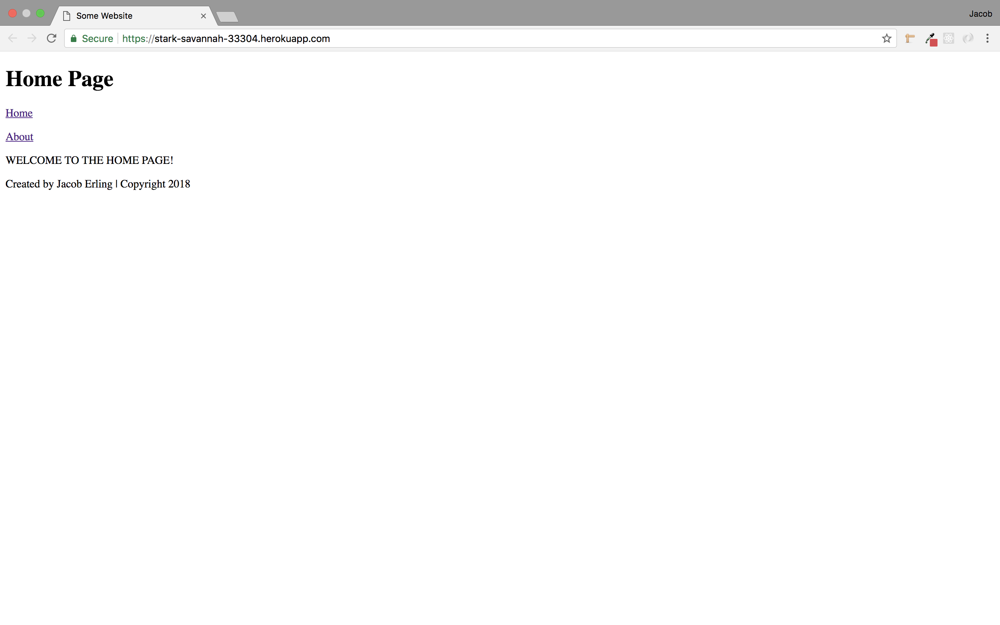

# Node-Server
This is a repository created to practice setting up a NODE server. The app uses several different node packages like express, handlebars, and fs. The app utilizes express to set up the port of the server and the static directory. It also uses handlebars to create templating with partials and helpers. The last package the app uses is fs to keep track of a server log.

- Try not to get distracted by the sheer beauty of the application's front end design.

